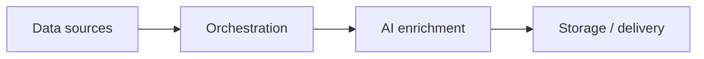

<!-- markdownlint-disable MD033 -->
<div align="center">
  <strong>No-Low-Code Workflows</strong>
  <br /><br />
  
  
  
  
  
</div>
<!-- markdownlint-enable MD033 -->

This repository bundles **three automation workflows** (n8n, Make) with AI integration (OpenAI, Gemini), deployable standalone or via Docker. Each subfolder contains the exported workflow, assets and, when applicable, a frontend or demo.

**Research context** : This repository is used for research on **how to collect and use data from social networks and communication channels** (email, TikTok, Instagram, RSS) **through no-code / low-code automation tools**. The goal is to assess orchestration (n8n, Make), scraping (Apify), AI enrichment (LLM, vision) and storage (Airtable, Google Sheets) to build reproducible pipelines without heavy custom development.

---

## Technical Core · Repository structure

| Layer | Stack |
|-------|--------|
| **Orchestration** | n8n, Make |
| **AI** | OpenAI GPT-3.5, Google Gemini |
| **Scraping** | Apify (TikTok, Instagram) |
| **Storage** | Airtable, Google Sheets, JSON (file) |
| **APIs** | Gmail API, TikTok (via Apify) |
| **Runtime** | Docker (Gmail), Make/n8n cloud (others) |

**Repository structure**

```
no-low-code/
├── gmail/                  # Gmail AI Dashboard (n8n + Docker + frontend)
│   ├── docker-compose.yml
│   ├── json/workflow.json
│   ├── assets/
│   └── frontend/
├── multi-scraper/          # Multi-Scraper (Make → Google Sheets)
│   ├── json/workflow.json
│   └── assets/
└── tiktok/                 # TikTok Intelligence (n8n → Airtable)
    ├── json/workflow.json
    └── assets/
```

---

## Global architecture

The three workflows share a single high-level pattern: **data sources → orchestration → AI enrichment → storage or delivery**.



---

## Workflows

### [Gmail AI Dashboard](gmail/)

End-to-end pipeline: fetch Gmail via the official API, analyse with OpenAI (summaries, urgency detection), then serve results in a **web interface** (sort, pin, archive, filters). One-command deploy with **Docker**. Ideal for centralising email monitoring and prioritising messages without opening Gmail.

| Role | Details |
|------|--------|
| Extraction | Automatic fetch of latest emails (Gmail API, 24h window) |
| Analysis | Summaries + urgency detection (OpenAI GPT-3.5) |
| UI | Vanilla JS dashboard (HTML5, CSS3, localStorage, Lucide) |
| Deploy | `docker-compose` (n8n + static server) |


---

### [Multi-Scraper IA](multi-scraper/)

Multi-source automated monitoring: aggregate **RSS feeds** (NVIDIA, OpenAI, Google, Microsoft…) and **Instagram** tech accounts via Apify, enrich with GPT summaries and Gemini image analysis, **deduplicate**, then export to **Google Sheets**. Run an AI monitoring dashboard with no code.

| Role | Details |
|------|--------|
| Aggregation | RSS + Instagram (Apify) |
| Enrichment | GPT-3.5 summaries + Gemini Pro image analysis |
| Deduplication | Pre-export processing to avoid duplicates |
| Export | Google Sheets (Title, URL, date, source, AI summary) |

**Demo** : [Google Sheet](https://docs.google.com/spreadsheets/d/17JXOTxNk7-EDYpSQIKgBH-hyClpwn7jkmSknl3Azs1A/edit).


---

### [TikTok Intelligence](tiktok/)

TikTok extraction by **keywords** or **accounts**: metrics (views, likes, comments, shares), **VTT subtitle** extraction, summaries and insights via OpenAI, then save to **Airtable**. Useful for creator monitoring, trends or video content analysis.

| Role | Details |
|------|--------|
| Source | TikTok via Apify (keywords or handles) |
| Metrics | Views, likes, comments, shares |
| Transcripts | Automatic VTT subtitles |
| Analysis | Summaries and insights OpenAI → Airtable |


---

Each workflow is **self-contained**: clone the subfolder, import the JSON into n8n or Make, set credentials (API keys, OAuth, Apify tokens), and run. No custom backend is required beyond the orchestrator and cloud services (Airtable, Sheets, Gmail).
