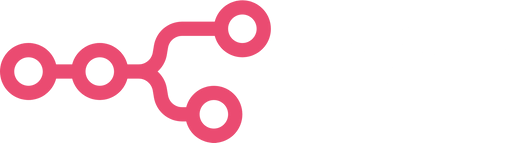

<p align="center">
  
</p>

<h1 align="center">📧 Gmail AI Dashboard</h1>

<p align="center">
  <strong>Automatisation Gmail avec analyse IA et interface web moderne</strong>
</p>

<p align="center">
  
  
  
  
  
</p>

---

## Aperçu

Ce workflow extrait automatiquement vos emails Gmail, les analyse avec OpenAI GPT-3.5, et affiche les résultats dans une interface web élégante.

**Architecture** : `Gmail API → n8n → OpenAI GPT-3.5 → JSON → Interface Web`

<p align="center">
  
</p>

---

## Fonctionnalités

- **Extraction Gmail** : Récupération automatique des derniers emails
- **Analyse IA** : Résumé et catégorisation par OpenAI
- **Dashboard Web** : Interface moderne pour visualiser les résultats
- **Webhook** : Rafraîchissement à la demande
- **Dockerisé** : Déploiement en une commande

<p align="center">
  
</p>

---

## Guide de démarrage rapide

### Prérequis

| Outil | Description |
|-------|-------------|
| Docker | Engine + Compose |
| Compte Google | Avec Gmail activé |
| OpenAI API | Avec crédits disponibles |

### Étape 1 : Cloner le repository

```bash
git clone https://github.com/Productivityio/workflow-n8n-gmail.git
cd workflow-n8n-gmail
```

### Étape 2 : Préparer les permissions

```bash
docker run --rm -v "$(pwd)/front-page/data:/data" alpine sh -c "chmod -R 777 /data"
```

### Étape 3 : Démarrer les services

```bash
docker-compose up -d
# Attendre 30 secondes pour l'initialisation
```

### Étape 4 : Importer le workflow

1. Ouvrir **http://localhost:5678**
2. Menu → **Import from File** → `json/workflow.json`

### Étape 5 : Configurer les credentials

#### Gmail OAuth2

1. [Google Cloud Console](https://console.cloud.google.com/) → Créer un projet
2. Activer **Gmail API**
3. Créer un **OAuth 2.0 Client ID** (type: Web app)
4. Configurer :
   - Authorized origins : `http://localhost:5678`
   - Redirect URI : `http://localhost:5678/rest/oauth2-credential/callback`
5. Dans n8n : nœud "Get many messages" → Create credential → Connecter

#### OpenAI

1. Créer une API key sur [platform.openai.com](https://platform.openai.com/api-keys)
2. Dans n8n : nœud "Basic LLM Chain" → Create credential → Coller la key

### Étape 6 : Tester et activer

```bash
# Test dans n8n : Bouton "Test workflow"
cat front-page/data/mails-today.json

# Activer le workflow : Toggle "Active" → ON
# Webhook manuel : 
curl -X POST http://localhost:5678/webhook/refresh-mails
```

---

## Points d'accès

| Service | URL |
|---------|-----|
| Interface web | http://localhost:8080 |
| n8n | http://localhost:5678 |
| JSON généré | http://localhost:8080/data/mails-today.json |

---

## Documentation

| Fichier | Description |
|---------|-------------|
| `rapport.md` | Difficultés techniques rencontrées |
| `json/README.md` | Configuration workflow n8n |
| `front-page/README.md` | Documentation interface |

---

## Dépannage

| Problème | Solution |
|----------|----------|
| Erreur OAuth | Vérifier les redirect URIs dans Google Console |
| JSON vide | Tester manuellement le workflow dans n8n |
| Port occupé | Modifier les ports dans `docker-compose.yml` |

---

<p align="center">
  Made by <a href="https://github.com/Productivityio">Productivityio</a>
</p>
