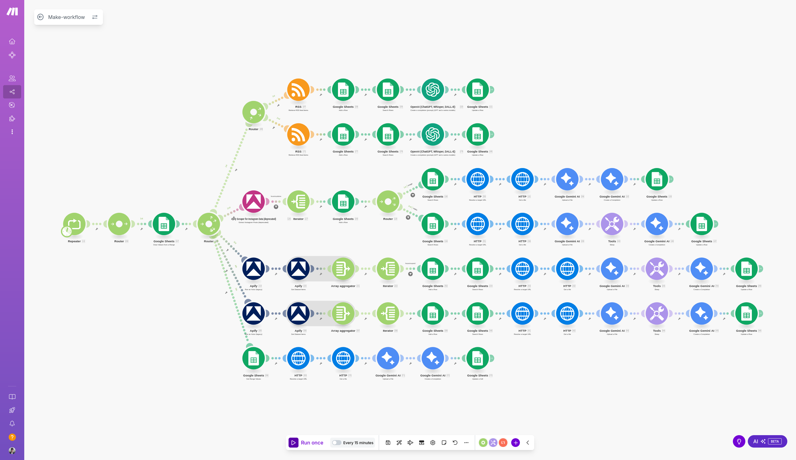

<p align="center">
  
</p>

<h1 align="center">🔍 Multi-Scraper IA</h1>

<p align="center">
  <strong>Veille IA automatisée : RSS + Instagram → Google Sheets enrichi</strong>
</p>

<p align="center">
  
  
  
  
  
</p>

---

## Aperçu

Workflow Make pour agrégation multi-sources de veille IA : flux RSS + comptes Instagram tech vers Google Sheets avec enrichissement IA automatique.

### Technical Core

| Layer | Implementation |
|-------|----------------|
| **Orchestration** | Make |
| **Sources** | RSS, Apify (Instagram) |
| **IA** | OpenAI GPT-3.5, Google Gemini (images) |
| **Stockage** | Google Sheets |
| **Runtime** | Make cloud |

**Architecture** : `RSS + Instagram → Make → OpenAI + Gemini → Google Sheets`

<p align="center">
  
</p>

---

## Fonctionnalités

- **Agrégation RSS** : Flux IA majeurs (NVIDIA, OpenAI, Google, Microsoft...)
- **Scraping Instagram** : Comptes tech via Apify
- **Enrichissement IA** : Résumés GPT-3 + analyse d'images Gemini Pro
- **Déduplication** : Évite les doublons automatiquement
- **Export structuré** : Titre, URL, date, source, résumé IA

<p align="center">
  
</p>

---

## Guide de démarrage rapide

### Prérequis

| Service | Description |
|---------|-------------|
| Make | Compte gratuit ou payant |
| Google Sheets | Compte Google |
| OpenAI API | Avec crédits disponibles |
| Gemini API | Google AI Studio |
| Apify | Pour scraping Instagram |

### Étape 1 : Cloner le repository

```bash
git clone https://github.com/Productivityio/workflow-make-multi-scraper.git
cd workflow-make-multi-scraper
```

### Étape 2 : Créer le Google Sheet

1. Créer un nouveau Google Sheets
2. Ajouter les colonnes : `Titre | URL | Date | Source | Résumé IA`
3. Copier l'ID du spreadsheet (dans l'URL)

### Étape 3 : Importer le workflow

1. Ouvrir [Make.com](https://make.com)
2. Scenarios → **Create a new scenario**
3. Menu (**⋮**) → **Import Blueprint**
4. Sélectionner `json/workflow.json`

### Étape 4 : Configurer les credentials

| Service | Configuration |
|---------|---------------|
| Google Sheets | Connecter compte Google + ID spreadsheet |
| OpenAI | API key depuis platform.openai.com |
| Gemini | API key depuis Google AI Studio |
| Apify | Token depuis apify.com/account |

### Étape 5 : Configurer les sources

1. **RSS** : Modifier les URLs des flux dans le module RSS
2. **Instagram** : Modifier la liste des comptes à scraper

### Étape 6 : Tester et planifier

```
1. Cliquer "Run once" pour tester
2. Vérifier le Google Sheets
3. Activer la planification (ex: toutes les 6h)
```

---

## Démo

[Google Sheet de démonstration](https://docs.google.com/spreadsheets/d/17JXOTxNk7-EDYpSQIKgBH-hyClpwn7jkmSknl3Azs1A/edit)

---

## Dépannage

| Problème | Solution |
|----------|----------|
| API limits | Vérifier quotas OpenAI/Gemini |
| Rate limiting | Réduire fréquence d'exécution |
| Permissions | Vérifier accès Google Sheets |
| Instagram bloqué | Vérifier token Apify et quotas |

---

## Structure du projet

```
workflow-make-multi-scraper/
├── README.md           # Ce fichier
├── json/
│   └── workflow.json   # Blueprint Make à importer
└── assets/
    ├── make-logo.png
    ├── make-workflow.png
    └── data-sheet.png
```

---

<p align="center">
  Made by <a href="https://github.com/Productivityio">Productivityio</a>
</p>
